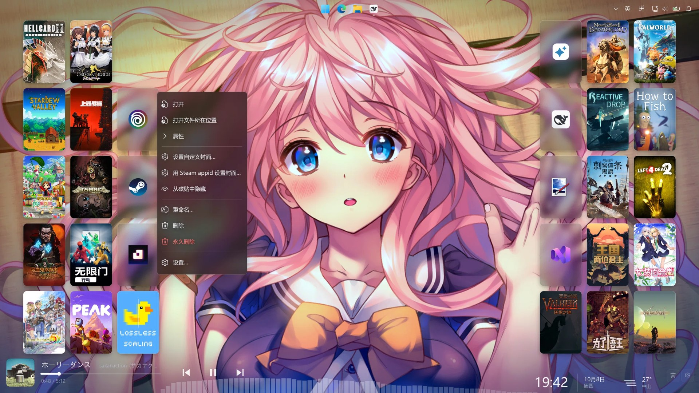
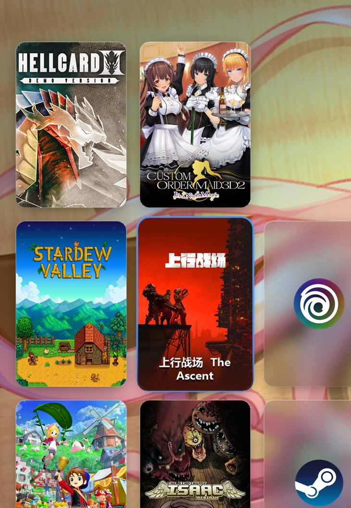

# TileDesk — 把桌面图标变成磁贴墙

一个约 230 KB 的**独立 exe**：**隐藏 Windows 原生桌面图标，改用 Steam 库那种竖版封面墙**。
双击就能跑，不需要安装任何东西、不需要任何脚本、没有第三方依赖
（只用 Windows 自带的 .NET Framework 4.x）。

安装、设置、卸载**全都在这个 exe 自己里面**，不用碰 PowerShell。

* **封面铺满整张卡**（2:3，和 Steam 竖版封面一致），圆角 + 细描边 + 柔和投影
* **没有封面的项目**（普通软件快捷方式）才用**透明亚克力卡片**：
  卡片内部取的是同一张壁纸、同一屏幕位置、重度模糊的副本，再叠白色着色和玻璃渐变
* **壁纸完整可见** —— 逐像素透明的分层窗口，只有卡片不透明，
  其余区域连鼠标点击都穿透给桌面
* 默认不显示文字，追求封面墙的干净观感；**鼠标悬停时**卡片放大、转强调色描边、名称与遮罩随后淡入（移开时反向播放）
* 屏幕底部居中一条**音频频谱**：回环采集系统输出做 FFT，低、中、高频段分开显示，柱数、柱宽、高度、宽度、透明度、下落速度都在设置里调
* 自动读取桌面快捷方式，Steam 游戏自动配官方竖版封面（`library_600x900`）
* 随时可还原：卸载时自动恢复原生桌面图标

**版本 2.1.2.2** ｜ **运行环境**：Windows 10 1809 或更高（Windows 11 可用），需要 .NET Framework 4.x（系统自带）



悬停效果：



---

## 快速开始

**打开 TileDesk.exe 。**

首次运行会弹一个引导框，问你：

* **是** → 复制到 `%LOCALAPPDATA%\Programs\TileDesk`、设置开机自启，之后连这个 exe 都不用留
* **否** → 就地运行，什么都不改

### 控制入口：磁贴墙右下角的两个按钮

**鼠标移到屏幕右下角**（磁贴墙的右下角）会看到 **垃圾桶** 和 **齿轮** 两个按钮：

| 齿轮菜单 | 作用 |
|---|---|
| **设置…** | 打开图形化设置界面（改完立刻生效，不用手改 JSON） |
| 隐藏 / 显示磁贴墙 | 临时收起整面墙 |
| 刷新磁贴 | 重新扫描桌面 |
| 自动排列卡片 | 网格排列与自由排列之间切换 |
| 重置卡片位置 | 卡片回到网格默认位置 |
| 重新载入壁纸 | 重新读取壁纸并重烤卡片底 |
| 卡片深色模式 | 无封面卡片底压成深色调 |
| 打开数据目录 / 查看日志 | 打开 `%LOCALAPPDATA%\TileDesk`、打开日志文件 |
| 隐藏 Windows 原生桌面图标 | 一键隐藏 / 恢复原生图标 |
| 开机自动启动 | 开关 |
| 窗口停在桌面底层 / 壁纸层 | 切换窗口层级模式 |
| 安装到本机 / 卸载并还原系统 | 复制到本机并开机自启；卸载时恢复原生桌面图标 |
| **退出 TileDesk** | 退出 |

| 垃圾桶按钮 | 作用 |
|---|---|
| 单击 / 右键 | 弹出菜单：回收站里有几项多少字节 / **打开回收站窗口** / **清空回收站…** |
| 把卡片拖上去 | 那个桌面快捷方式**进回收站**（可还原），其余卡片自动补位 |

> 「清空回收站」走的是 `SHEmptyRecycleBin` / `SHQueryRecycleBin` 这些 shell32 API，
> **不需要 shell 开窗口** —— 所以在"打开回收站窗口"被系统挡住的环境里它照样能用。
> 详见下面「实现要点」里关于受限环境的那一条。

启动后 12 秒内按钮是全亮的，之后收敛成低调的常驻按钮（悬停时再亮起来）。
不想要它们：设置里关掉「显示右下角按钮」。

**右键任意一张卡片**还能拿到：打开 / 打开文件所在位置 / 属性 / **设置自定义封面** /
**用 Steam appid 设置封面** / 从磁贴中隐藏 / **重命名** / **删除（放进回收站）** /
**永久删除（不进回收站，红字并二次确认）** / 设置。

> 「用 Steam appid 设置封面」用在 appid 没认出来（或认错了）的快捷方式上：
> 输入 Steam 商店地址里的ID（例如 `store.steampowered.com/app/413150/` 里的
> `413150`），程序会去拉这张游戏的官方竖版封面并固化成这张卡的自定义封面。

### 常用操作

| 操作 | 效果 |
|---|---|
| 双击卡片 | 打开（成功后卡片会有一个脉冲反馈：轻微放大 + 一圈强调色扩散） |
| **拖动卡片** | 重排：被拖的卡片跟手浮起，**其他卡片自动让位**，松手落位并记住顺序 |
| **拖到垃圾桶** | 删掉桌面图标（进回收站） |
| **Ctrl + 滚轮** | 缩放卡片大小（保持 2:3，自动保存） |
| 滚轮 | 上下滚动 |
| 右键卡片 | 见上 |
| 右键空白处 | 桌面自己的菜单（空白处鼠标是穿透的） |
| 托盘图标 | 同一套菜单；Win11 默认收在任务栏「^」溢出区 |

> 菜单是**独立的 WPF 窗口**（不是画在磁贴墙上）：圆角、亚克力磨砂、左侧 Fluent 图标、
> 悬停高亮、勾选项、分隔线全部由它渲染，背景走系统的 `DWMWA_SYSTEMBACKDROP_TYPE`。
> 打开时渲染一次，鼠标划过只重绘受影响的那一项。
> 早期版本试过「画在磁贴墙里」和「自绘分层窗口」两种做法，分别在层级和性能上出问题，已废弃。

### 自动同步

程序会**监视桌面文件夹**（用户桌面 + 公共桌面 + 你额外加的目录），
在桌面新建 / 删除 / 改名快捷方式后约 1 秒内，磁贴墙会自动跟着增删、自动重排补位。

> **托盘图标**里有一份一模一样的菜单。但 Windows 11 默认把新出现的托盘图标收进
> 任务栏的 **「^」溢出区**，所以**右下角的齿轮按钮才是最稳的入口**。
> 想让托盘图标也常显：**设置 → 个性化 → 任务栏 → 其他系统托盘图标 → 把 TileDesk 打开**。

### 也可以纯命令行（方便批量部署）

```powershell
TileDesk.exe --install              # 安装到本机 + 开机自启
TileDesk.exe --uninstall            # 关自启 + 恢复原生图标 + 删除安装目录
TileDesk.exe --uninstall --purge    # 连配置和封面缓存一起删
```

### 从源码编译（可选）

exe 已经编译好了，不改代码的话不需要这一步。

```powershell
cd tiledesk
.\build.ps1        # 用系统自带的 .NET 编译器编译，产出 build\ 和 dist\
```


---

## 用法

| 操作 | 效果 |
|---|---|
| 双击卡片 | 打开（和双击桌面图标一样） |
| 单击卡片 | 选中（强调色描边） |
| 右键卡片 | 打开 / 打开文件所在位置 / 属性 / 封面 / 从磁贴中隐藏 / 重命名 / 删除 / 永久删除 / 设置 |
| 滚轮 | 平滑滚动 |
| 点空白处 | 穿透给桌面（因为那里本来就是透明的） |
| 右键空白处 | 桌面自己的右键菜单 |
| **右键托盘图标** | 显示/隐藏磁贴墙、刷新、窗口层级、**设置**、数据目录、日志、原生图标开关、开机自启、**退出** |
| **双击托盘图标** | 快速显示 / 隐藏磁贴墙（会再问一句要不要退出） |

> **托盘图标在哪？** Windows 11 默认把新出现的托盘图标收进任务栏的 **「^」溢出区**，
> 不在常显区域里。想让它一直可见：
> **设置 → 个性化 → 任务栏 → 其他系统托盘图标 → 把 TileDesk 打开**。
> 首次运行的引导框里也写了这一点；之后再双击 `TileDesk.exe`，
> 会弹框告诉你「已经在运行，控制入口在托盘图标上」。

**新增图标**：往桌面放快捷方式，托盘菜单点「刷新磁贴」。

**给非 Steam 项目配封面**：在快捷方式旁边放一张
`<快捷方式同名>.jpg` / `cover.jpg` / `folder.jpg` / `poster.jpg` 即可。

---

## 数据在哪

| 内容 | 位置 |
|---|---|
| 配置 | `%LOCALAPPDATA%\TileDesk\config.json` |
| **封面缓存** | `%LOCALAPPDATA%\TileDesk\art\` |
| 自定义封面 | `%LOCALAPPDATA%\TileDesk\covers\` |
| 运行日志（默认关闭） | `%LOCALAPPDATA%\TileDesk\tiledesk.log` |

日志默认关闭，关闭时不创建文件。需要排查问题时在菜单或设置里打开「写详细日志」；日志超过 1 MB 轮转成 `tiledesk.log.1`，保留两份。齿轮菜单里也有「打开数据目录」。

程序按下面的顺序挑第一个**可写**的目录，并且**已经在用的那个（里面已有 `config.json`）
优先** —— 这样即使运行环境变化，数据目录也不会在两者之间"搬家"：

1. `--data` 参数指定的目录
2. 环境变量 `TILEDESK_HOME`
3. `%LOCALAPPDATA%\TileDesk`   ← 正常双击运行时用这个
4. exe 旁边的 `TileDesk-data\`  ← 上面那个不可写时（受限进程/绿色版）回落到这里
5. `%TEMP%\TileDesk`

> **封面只下载一次**，之后从本地缓存读 —— 所以第一次启动会慢十几秒（逐个下载），
> 之后就秒开。**清空 `art\` 会让它重新下一次**。
> 桌面项的自定义顺序和隐藏列表也都存在 `config.json` 里，同样别删。

## 配置文件

一般不用手改（齿轮 → 设置… 有图形界面），列在这里备查。

托盘菜单 →「设置（打开配置文件）」，路径 `%LOCALAPPDATA%\TileDesk\config.json`。
改完保存，托盘 →「退出 TileDesk」，再启动即可。

| 键 | 默认 | 说明 |
|---|---|---|
| `cardWidth` / `cardHeight` | 115 / 172 | 卡片尺寸（100% DPI 下的逻辑像素），2:3 和 Steam 封面一致 |
| `gap` | 14 | 卡片间距，调小更密 |
| `padding` | 28 | 卡片区到屏幕边缘的距离（不含任务栏） |
| `cornerRadius` | 10 | 圆角半径 |
| `cardOpacity` | 1.0 | **整张卡片（含投影）的不透明度** —— 卡片多了想让壁纸透出来就调小 |
| `uiScale` | 0 | `0` = 跟随系统 DPI 自动缩放；也可填 `1` / `1.5` / `2` 强制指定 |
| `showLabels` | false | 是否在卡片上常态显示名称（默认关，追求封面墙效果） |
| `labelsOnHover` | true | 悬停时是否浮出名称 |
| `acrylicTint` | 0.10 | 无封面卡片的白色磨砂着色强度，越大越"雾" |
| `acrylicBrightness` | 0.46 | 无封面卡片内壁纸的压暗系数，浅色壁纸调小更清楚 |
| `acrylicBlur` | 56 | 无封面卡片内背景的模糊半径（逻辑像素） |
| `shadowOpacity` | 0.60 | 投影不透明度 |
| `shadowSize` | 24 | 投影扩散半径 |
| `showControlButton` | true | 右下角常驻按钮（关掉后只能靠托盘图标操作） |
| `sortMode` | `"Name"` | `Name` / `Date` / `Kind` / `Custom`（拖拽后的自定义顺序） |
| `order` | `[]` | `sortMode = Custom` 时的顺序，元素是桌面项文件名 |
| `watchDesktop` | true | 监视桌面文件夹，图标增删自动同步 |
| `accentColor` | `#4C9AFF` | 悬停 / 选中的强调色 |
| `sortMode` | `"Name"` | `Name` / `Date` / `Kind` / `Custom` |
| `sortDescending` | false | 倒序 |
| `fontFamily` | `"Microsoft YaHei UI"` | 字体，找不到会自动回退 |
| `downloadSteamArt` | true | 本地没有封面时联网补下（缓存在 `%LOCALAPPDATA%\TileDesk\art`） |
| `windowMode` | `"Bottom"` | `Bottom` 桌面底层（当前可用）/ `Desktop` 壁纸层（见下） |
| `autoStartWithWindows` | false | 仅作记录，实际以注册表 Run 项为准 |
| `hidden` | `[]` | 不显示的桌面项文件名 |
| `extraFolders` | `[]` | 额外要显示成磁贴的文件夹 |
| `exclude` | `[]` | 排除规则，支持 `*.txt` 这种后缀通配 |

**想让网格更密**：`cardWidth`/`cardHeight`/`gap` 一起调小，列数会自动重算。
**想让无封面卡片更"透"**：`acrylicBrightness` 调大、`acrylicTint` 调小。
**想显示名称**：`showLabels` 改 `true`。

---

## 关于窗口层级（重要）

理想情况是把窗口挂进桌面的 `WorkerW` 壁纸层（Rainmeter / Wallpaper Engine 的做法）。**这条路在你机器上被系统封了**：
Windows 11 build 26300 对跨进程 `SetParent(hwnd, Progman)` 直接返回 `ERROR_ACCESS_DENIED (5)`，
`0x052C` 也不再生成可用的顶层 `WorkerW`。程序探测到之后自动用下面这套方案：

1. 窗口铺满**工作区**（不是整屏）—— 所以任务栏在顶部、底部还是侧边都不受影响，
   磁贴永远不会压到任务栏，任务栏移动后会自动跟着改
2. 用 `SetWindowPos(progman, hwnd, …)` 把自己精确排到 **Progman 正上方**：
   在壁纸之上（透明像素能透出壁纸）、在所有应用窗口之下
   * 放在 `HWND_BOTTOM` 是不行的：会落到 Progman 下面，桌面图标那个全屏列表控件
     会把悬停和点击全部吃掉，卡片就变成只能看不能点
3. `WM_MOUSEACTIVATE` 返回 `MA_NOACTIVATE`，点击不会把自己顶到最前面
4. 拦截 `WM_SYSCOMMAND / SC_MINIMIZE`，`Win+D`／「显示桌面」不会把磁贴墙一起最小化
5. `WS_EX_TOOLWINDOW`，不进任务栏也不进 Alt+Tab
6. 每 2 秒低频校正一次 z 序，防止被别的"桌面挂件"挤走

托盘菜单 →「窗口层级」可以随时重试壁纸层模式；哪天系统放开限制，它会自动生效。

---

## 目录结构

```
tiledesk/
├─ src/                    源码（C# 5，用系统自带 csc 编译）
│  ├─ Program.cs           入口 / 桌面层级探测 / 系统集成（图标开关、开机自启、安装卸载）
│  ├─ TileForm.cs          分层窗口、卡片渲染、布局、交互、拖拽、频谱绘制、托盘
│  ├─ SettingsForm.cs      图形化设置界面
│  ├─ UiKit.cs             自绘控件（滑块、开关、分段选择、输入框、弹窗）
│  ├─ WpfMenu.cs           右键菜单（独立 WPF 窗口，系统亚克力背景）
│  ├─ NowPlaying.cs        系统媒体控件（SMTC）读取
│  ├─ NowPlayingWidget.cs  正在播放控件（独立分层窗口）
│  ├─ DeskInfoWindow.cs    时钟与天气控件（独立分层窗口）
│  ├─ AudioSpectrum.cs     WASAPI 回环采集 + FFT + 频段合并
│  ├─ AudioMeter.cs        系统音量峰值（备用，默认不用）
│  ├─ Core.cs              图标提取、Steam 封面解析、模糊与亚克力素材、色彩工具
│  ├─ Config.cs            配置读写与数据目录回退
│  ├─ Native.cs            Win32 / Shell P/Invoke
│  ├─ Version.cs           版本号（与 AssemblyInfo 保持一致）
│  ├─ AssemblyInfo.cs     程序集版本信息
│  ├─ app.ico            程序图标
│  └─ app.manifest        DPI 感知声明
├─ build.ps1               编译脚本（不改代码用不到）
├─ preview.jpg             预览图
├─ preview-hover.jpg       悬停效果图
└─ build/ dist/            编译产物，未纳入版本控制
```

## 实现要点

* **磁贴墙是一个全屏分层窗口**（`WS_EX_LAYERED` + 逐像素透明）。画面先画进一张
  `CreateDIBSection` 位图，再整块或按脏区上传给系统；空白处的鼠标点击穿透到桌面。
* **窗口层级**：停在桌面层 —— Progman 之上、所有普通窗口之下。这是桌面该在的位置，
  也因此最大化窗口会盖住磁贴墙。壁纸层模式需要系统放开限制，被拒绝时自动回退。
* **只重画变化的部分**：卡片移动、悬停、频谱各自标脏区，合并后一次上传。
  空闲时降低刷新频率，有动画或频谱在跑时提到最高帧率。
* **卡片是预烤位图**：常规版与悬停版各一张（含圆角、描边、投影），悬停过渡只做
  "放大 + 淡化"，不每帧重画。被拖动的卡片每帧重烤一张，因为卡片底是按屏幕位置取样的。
* **无封面卡片的底**＝同一张壁纸、同一屏幕位置的模糊副本 ＋ 白色着色 ＋ 细噪点 ＋
  玻璃渐变 ＋ 图标主色柔光。深色模式只压亮度、保留色相。
* **菜单是独立的 WPF 窗口**：圆角、亚克力磨砂、左侧 Fluent 图标，背景用系统的
  `DWMWA_SYSTEMBACKDROP_TYPE`。打开时渲染一次，鼠标划过只重绘受影响的那一项。
* **正在播放**取自系统媒体控件（SMTC），显示在独立的分层窗口里，磁贴墙不参与它的渲染。
* **音频频谱**：WASAPI 回环采集默认播放设备的输出（`IAudioClient` + `IAudioCaptureClient`），
  1024 点汉宁窗 FFT，按对数频段（40Hz–16kHz）合并成柱子。全部走 COM 互操作。
  平滑分三层：逐 bin 时间平滑、频段内取平均、柱子下落曲线。
* **界面全部自绘**（`UiKit.cs`、`SettingsForm.cs`）：原生 WinForms 控件在暗色下不可用。
  设置改动合并 180 毫秒后统一应用，拖滑块不会反复重建缓存。
* **DPI**：进程声明为 DPI 感知，配置里存的是 96 DPI 下的逻辑像素，运行时乘缩放。
* **位置持久化**按文件名记在 `config.json` 的 `order` / `positions` 里，与机器无关。
* **无第三方依赖**：只用 .NET Framework 4.x 自带程序集（WinForms、WPF、Drawing、Device）。
  构建脚本 `build.ps1` 调用系统自带的 Roslyn 编译器。

## 命令行参数

```
TileDesk.exe                    正常启动（桌面底层模式）
TileDesk.exe --windowed         置顶预览窗口，自带壁纸底
TileDesk.exe --mode Desktop     强制尝试壁纸层模式
TileDesk.exe --mode Bottom      强制桌面底层模式
TileDesk.exe --data <目录>      指定数据目录
```

环境变量 `TILEDESK_DEMO_HOVER=<卡片序号>` 可以让指定卡片保持悬停态，方便截图展示。

## 资源占用

在 3840×2160 @200%、26 个项目的实测值：

* 空闲 CPU **0%**（只有一个 16ms 空转计时器）
* 悬停 / 滚动动画 **9 ms/帧**，约 110 fps 的渲染能力（计时器上限 60fps，实际满帧）
* 内存约 **170 MB**（全屏分层位图 + 26 张卡片缓存 + 26 张 256px 图标 + 26 张封面图）

## 排错

* 日志：`%LOCALAPPDATA%\TileDesk\tiledesk.log`（托盘菜单 →「查看日志」）
* 卡片挡住任务栏 / 位置不对：托盘 →「窗口层级」重选一次，或重启程序
* 浅色壁纸下文字发虚：把 `acrylicBrightness` 调到 0.3 左右
* 有图标没封面：那张封面在 Steam CDN 上不存在（未发售 / Demo 常见），
  卡片会自动退回「图标 + 主色柔光」样式，属正常表现
* 想临时看回原桌面：托盘 →「显示 / 隐藏磁贴墙」取消勾选

## 已知限制

* 卡片底与频谱采用「预模糊壁纸按位置取样」，属于壁纸蒙版做法，不是系统级实时模糊。
  系统级亚克力需要每张卡片独立成窗口，属于另一套渲染结构。
* 频谱绘制在墙上，被其他窗口覆盖时不显示；墙隐藏时一并隐藏。
* 菜单绘制在独立窗口上，任务栏的隐藏图标面板、开始菜单等系统面板显示层级高于本程序，
  面板打开期间会遮挡菜单。
* 壁纸层模式需要系统允许程序调整窗口层级，被拒绝时回退到桌面底层模式。

## 反馈

打开「写详细日志」，复现一次，把 `%LOCALAPPDATA%\TileDesk\tiledesk.log` 与版本号一并提供。
版本号在齿轮菜单底部，或文件属性的文件版本中查看。